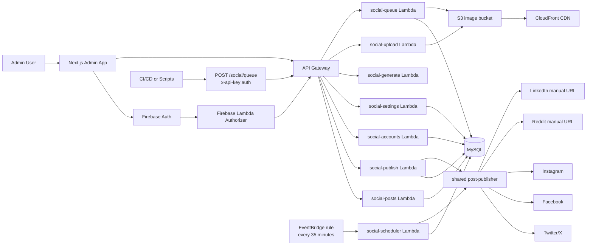

# Social Posting Service

CreditOdds' social posting service is a small publishing system built around:

- A Next.js admin dashboard for manual drafting, queueing, review, and one-click publishing
- A SAM-deployed Lambda API for CRUD, upload, AI generation, scheduling, and platform fan-out
- A MySQL-backed queue that decides what should publish next
- An API-key endpoint for CI/CD or other automation to enqueue posts without going through the UI

The service already supports more than a simple FIFO queue. Posts can be prioritized, assigned to queue groups, spaced apart, delayed until `scheduled_at`, and blocked during blackout windows.

## What It Does

There are two main ways to interact with the system:

### 1. Admin dashboard

The web app in [`web/`](./web) is for authenticated admins.

- `/` shows the queue, drafts, failures, and quick actions
- `/compose` creates draft or queued posts
- `/history` shows previously posted content
- `/accounts` enables or disables platform accounts
- `/settings` controls blackout windows and global queue spacing

Today the compose UI exposes:

- post text
- optional image
- optional link
- optional platform selection
- queue priority
- optional queue group
- optional per-post minimum gap
- AI-assisted text generation

The admin post API supports `scheduled_at`, but the current compose form does not expose it yet.

### 2. Automation / CI queue API

The API endpoint `POST /social/queue` accepts an `x-api-key` and lets external systems enqueue posts directly. This is how CI/CD or content workflows can push social items into the queue without requiring Firebase auth.

Example payload:

```json
{
  "text_content": "BREAKING: New welcome bonus just landed.",
  "twitter_text": "BREAKING: New welcome bonus just landed.",
  "link_url": "https://creditodds.com/news/example",
  "source_type": "news",
  "source_id": "example",
  "priority": 100,
  "queue_group": "breaking-news",
  "min_gap_minutes": 180,
  "platforms": ["twitter", "facebook"]
}
```

It can also accept `image_base64` plus `image_mime_type`, upload that image to S3, and store the CDN URL on the queued post.

Current limitation: the automation queue endpoint does not currently accept `scheduled_at`, so exact-time scheduling is only partially implemented today.

## Architecture

### High-level flow



### Core components

#### Backend

The API lives in [`api/`](./api) and is deployed with AWS SAM using [`api/template.yml`](./api/template.yml).

Main handlers:

- [`api/src/handlers/social-posts.js`](./api/src/handlers/social-posts.js): admin CRUD for posts and queue estimation
- [`api/src/handlers/social-scheduler.js`](./api/src/handlers/social-scheduler.js): scheduled publisher, triggered every 35 minutes
- [`api/src/handlers/social-publish.js`](./api/src/handlers/social-publish.js): admin "post now" endpoint
- [`api/src/handlers/social-queue.js`](./api/src/handlers/social-queue.js): CI/CD queue ingestion via API key
- [`api/src/handlers/social-upload.js`](./api/src/handlers/social-upload.js): presigned S3 upload URL generation
- [`api/src/handlers/social-generate.js`](./api/src/handlers/social-generate.js): Anthropic-backed copy generation
- [`api/src/handlers/social-settings.js`](./api/src/handlers/social-settings.js): blackout window and global queue settings
- [`api/src/handlers/social-accounts.js`](./api/src/handlers/social-accounts.js): platform account status
- [`api/src/handlers/firebase-authorizer.js`](./api/src/handlers/firebase-authorizer.js): Firebase token verification for API Gateway

Shared libs:

- [`api/src/lib/post-publisher.js`](./api/src/lib/post-publisher.js): common publish orchestration used by both manual publish and the scheduler
- [`api/src/lib/blackout.js`](./api/src/lib/blackout.js): blackout-window evaluation and "next valid tick" logic
- [`api/src/lib/settings.js`](./api/src/lib/settings.js): default settings and settings loading
- [`api/src/lib/platforms/`](./api/src/lib/platforms): per-platform adapters

#### Frontend

The admin UI lives in [`web/`](./web) and is a Next.js 15 app with Firebase Auth.

Important frontend files:

- [`web/src/lib/api.ts`](./web/src/lib/api.ts): API client and shared types
- [`web/src/components/PostForm.tsx`](./web/src/components/PostForm.tsx): manual compose flow
- [`web/src/components/PostCard.tsx`](./web/src/components/PostCard.tsx): queue card, result display, publish actions
- [`web/src/app/page.tsx`](./web/src/app/page.tsx): queue dashboard
- [`web/src/app/settings/page.tsx`](./web/src/app/settings/page.tsx): blackout and global spacing controls
- [`web/src/auth/AuthProvider.tsx`](./web/src/auth/AuthProvider.tsx): Firebase auth and admin gating

### Data model

The schema is defined by the checked-in SQL migrations in [`migrations/`](./migrations).

Main tables:

- `social_posts`: the source of truth for queued, draft, posting, posted, failed, and cancelled posts
- `social_post_results`: one row per platform attempt
- `social_accounts`: platform enablement, connection state, and last error
- `social_settings`: global settings JSON, currently blackout and queue spacing

Important `social_posts` fields:

- `status`: `draft`, `queued`, `posting`, `posted`, `failed`, `cancelled`
- `priority`: higher numbers win first
- `scheduled_at`: post is not eligible until this time
- `queue_group`: optional content family or lane, like `evergreen` or `breaking-news`
- `min_gap_minutes`: optional extra spacing rule within a queue group
- `platforms`: JSON array of target platforms; `NULL` means "all active connected platforms"

### Publish lifecycle

#### Manual flow

1. Admin signs in through Firebase.
2. Web app gets a Firebase ID token.
3. API Gateway authorizes requests through the custom Firebase authorizer.
4. Admin creates a draft or queued post through `POST /social/posts`.
5. Admin can manually force publication through `POST /social/publish`.
6. The shared publisher fans the post out to all eligible platforms and records per-platform results.

#### Automated flow

1. CI/CD or a script calls `POST /social/queue` with the shared API key.
2. The service stores a queued post immediately.
3. EventBridge triggers the scheduler every 35 minutes.
4. The scheduler selects the highest-priority eligible post.
5. The shared publisher executes the publish and stores results.

### Queue selection rules

The scheduler does not just post the oldest row. A post is eligible only when all of these are satisfied:

- status is `queued`
- `scheduled_at` is null or already in the past
- the current time is not inside the configured blackout window
- the global minimum gap has elapsed since the most recent posted item
- if the post has a `queue_group` and `min_gap_minutes`, that group-specific gap has elapsed

If multiple posts are eligible, selection order is:

1. highest `priority`
2. earliest `scheduled_at`
3. earliest `created_at`

The queue dashboard also estimates future publish times for queued posts using the same spacing and blackout logic.
Those estimates are computed at read time, not stored as scheduled jobs, so they should be treated as advisory.

## Platform Behavior

Publishing behavior varies by platform:

- Twitter/X: posts the main text, uploads media if present, and places the link in a reply tweet
- Facebook: creates a page post, uses a photo post when an image exists, and places the link in a comment
- Instagram: requires an image and uses the Graph API container/publish flow; links are added as comments
- Reddit: generates a prefilled manual submit URL instead of API posting
- LinkedIn: generates a prefilled manual share URL instead of API posting

That means the platform layer is currently mixed:

- automated publishing for Twitter, Facebook, and Instagram
- human-assisted publishing for Reddit and LinkedIn

## API Surface

Admin-authenticated endpoints:

- `GET /social/posts`
- `POST /social/posts`
- `PUT /social/posts`
- `DELETE /social/posts`
- `POST /social/publish`
- `GET /social/accounts`
- `PUT /social/accounts`
- `GET /social/settings`
- `PUT /social/settings`
- `POST /social/generate`
- `POST /social/upload`

API-key endpoint:

- `POST /social/queue`

## Setup And Operations

### Database migrations

Apply the SQL files in [`migrations/`](./migrations) to the existing MySQL database:

1. [`migrations/001_create_social_tables.sql`](./migrations/001_create_social_tables.sql)
2. [`migrations/002_add_queue_priority_spacing.sql`](./migrations/002_add_queue_priority_spacing.sql)
3. [`migrations/003_add_social_settings.sql`](./migrations/003_add_social_settings.sql)
4. [`migrations/004_add_twitter_text.sql`](./migrations/004_add_twitter_text.sql)

If you are applying these to a fresh environment, check for overlap first. `001_create_social_tables.sql` already includes fields and tables that later migrations also introduce.

### Backend environment variables

Declared in [`api/template.yml`](./api/template.yml):

- `ENDPOINT`
- `DATABASE`
- `USERNAME`
- `PASSWORD`
- `ANTHROPICAPIKEY`
- `SOCIALAPIKEY`
- `TWITTERAPIKEY`
- `TWITTERAPISECRET`
- `TWITTERACCESSTOKEN`
- `TWITTERACCESSTOKENSECRET`
- `FACEBOOKPAGEID`
- `FACEBOOKPAGEACCESSTOKEN`

Also referenced in code:

- `INSTAGRAM_ACCOUNT_ID`
- `REDDIT_SUBREDDIT`
- `FIREBASE_PROJECT_ID`
- `S3_BUCKET`
- `CDN_DOMAIN`

Note that `INSTAGRAM_ACCOUNT_ID` is used by the Instagram adapter but is not currently declared as a SAM parameter in `template.yml`.

### Web environment variables

Used by the Next.js app:

- `NEXT_PUBLIC_API_URL`
- `NEXT_PUBLIC_FIREBASE_API_KEY`
- `NEXT_PUBLIC_FIREBASE_AUTH_DOMAIN`
- `NEXT_PUBLIC_FIREBASE_PROJECT_ID`
- `NEXT_PUBLIC_FIREBASE_STORAGE_BUCKET`
- `NEXT_PUBLIC_FIREBASE_MESSAGING_SENDER_ID`
- `NEXT_PUBLIC_FIREBASE_APP_ID`

### Local development

Web app:

```bash
cd web
npm install
npm run dev
```

Backend:

```bash
cd api
npm install
sam build
sam local start-api
```

Current-state note: this repo does not include a dedicated local API dev script beyond the SAM template, so local backend iteration is currently more deployment-oriented than developer-optimized.

### Deployment

The backend is designed for AWS SAM deployment from [`api/`](./api):

```bash
cd api
sam build
sam deploy
```

The checked-in [`api/samconfig.toml`](./api/samconfig.toml) targets:

- stack: `CreditOddsSocialPostingService`
- region: `us-east-2`

## Current Design Review

### What is working well

- The service is small and easy to reason about.
- The queue model already supports more sophistication than a basic scheduler.
- Shared publish logic avoids duplicating platform orchestration.
- The separation between admin-authenticated endpoints and API-key automation is clean.
- Storing per-platform results makes failures visible in the UI.
- The estimated publish time feature gives the queue real operational value.

### Current limitations and design gaps

#### Exact-time scheduling is not truly exact yet

The admin post API supports `scheduled_at`, but the scheduler only runs every 35 minutes. In practice that means:

- posts are published on the next scheduler tick, not at the exact requested time
- blackout windows and spacing rules can push posts later than expected
- there is no SLA-like guarantee around minute-level timing

Also:

- the current compose UI does not let an admin set `scheduled_at`
- the automation queue endpoint does not accept `scheduled_at`

#### Manual-platform results need schema alignment

The publisher records `pending_manual` for manual flows like Reddit and LinkedIn, but the checked-in `social_post_results` migration only defines:

- `pending`
- `success`
- `failed`

If production schema has not already been updated elsewhere, this is a mismatch that should be fixed with a migration.

#### Platform configuration is partly code-based

Some account capability is represented in the database (`social_accounts`), but actual credentials and behavior still live in Lambda environment variables and code paths. That makes the account model operationally useful, but not fully self-describing.

#### The scheduler is coarse-grained

Running every 35 minutes is simple, but it creates tradeoffs:

- weaker timing precision
- slower retry behavior
- larger gaps between failure detection and recovery
- limited room for bursty or campaign-style scheduling

#### Local development and test coverage are thin

The repo currently has:

- no checked-in automated tests for queue logic or publish orchestration
- no dedicated local backend workflow beyond SAM
- no integration harness for exercising platform adapters safely

## Recommended Upgrades

### Priority 1: support true scheduled posting

If specific publish times matter, this is the biggest improvement to make.

Recommended options:

1. Add `scheduled_at` to the compose UI and extend the automation queue API if external systems need exact-time scheduling.
2. Change the scheduler model so exact-time posts do not depend on a 35-minute poll.
3. Use one of these execution models:

- Best fit: create a one-time EventBridge Scheduler job per post, then fall back to the queue only for backlog arbitration
- Simpler near-term option: reduce poll frequency to every 1 to 5 minutes
- More scalable option: move queued posts onto SQS with delayed delivery plus a worker Lambda

My recommendation is a hybrid:

- keep the MySQL queue as the source of truth
- create one-time execution events for posts with a specific `scheduled_at`
- reserve the recurring scheduler for unscheduled backlog draining and retries

That keeps the current design mostly intact while making exact-time posting real.

### Priority 2: formalize queue policy

Right now the queue policy is good but implicit.

Upgrades that would help:

- document queue groups as first-class lanes, with naming conventions
- add per-source defaults in one place
- add campaign-level or platform-level rate limits
- support "do not post before X, prefer before Y" windows
- support per-platform scheduling, not just per-post scheduling

### Priority 3: make publishing more durable

Recommended improvements:

- add attempt counters and retry backoff on `social_posts`
- distinguish `partially_posted` from fully failed
- persist publish job logs or correlation IDs
- add idempotency keys to queue ingestion so CI/CD can retry safely
- record who manually completed LinkedIn/Reddit flows and when

### Priority 4: improve observability

Useful additions:

- queue depth and oldest queued age metrics
- scheduled-post lag metric: actual post time minus requested schedule
- per-platform success-rate alarms
- dashboard surfacing for "manual completion required"
- audit events for create, edit, queue, cancel, publish, retry

### Priority 5: tighten platform abstraction

Recommended cleanup:

- represent platform capabilities explicitly: `automatic`, `manual`, `requires_image`, `supports_link_comment`, and so on
- move platform metadata into a shared config layer instead of spreading behavior across UI and adapters
- validate payloads per platform before queueing, not only at publish time

### Priority 6: invest in developer ergonomics

Recommended changes:

- add unit tests for queue ordering, blackout windows, and estimate calculation
- add integration tests for handler auth and state transitions
- add a local seed script for social tables and accounts
- add a fake platform adapter or dry-run mode for safe local testing

## Suggested Near-Term Roadmap

If we wanted the highest-value improvements without rebuilding everything, I would do this in order:

1. Add `scheduled_at` to the UI and, if needed, to the automation queue API.
2. Add a migration for `pending_manual` if production does not already have it.
3. Reduce scheduler cadence or introduce one-time scheduled jobs for exact-time posts.
4. Add basic tests around queue selection and blackout behavior.
5. Add better queue metrics and manual-completion visibility.

That would materially improve reliability and operator confidence without forcing a full rewrite.
