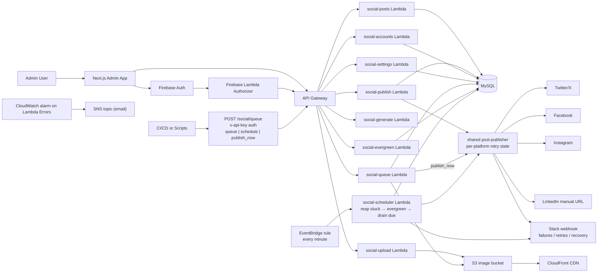

# Social Posting Service

CreditOdds' social posting service is a small publishing system built around:

- A Next.js admin dashboard for manual drafting, queueing, review, and one-click publishing
- A SAM-deployed Lambda API for CRUD, upload, AI generation, scheduling, and platform fan-out
- A MySQL-backed queue that decides what should publish next, drained by an every-minute scheduler
- An API-key endpoint for CI/CD or other automation to enqueue (or immediately publish) posts without going through the UI
- An evergreen content pool that re-queues recycled posts on a daily/weekly/monthly cadence
- Slack notifications for publish failures, retries, and stuck posts

Posts can be prioritized, assigned to queue groups, spaced apart, scheduled to the minute with `scheduled_at`, blocked during blackout windows, and retried automatically with backoff when a platform fails.

## What It Does

There are two main ways to interact with the system:

### 1. Admin dashboard

The web app in [`web/`](./web) is for authenticated admins.

- `/` shows the queue, drafts, failures, and quick actions
- `/compose` creates draft, queued, scheduled, or immediately-published posts
- `/evergreen` manages the recycled content pool and its cadences
- `/history` shows previously posted content
- `/accounts` enables or disables platform accounts
- `/settings` controls blackout windows and global queue spacing

The compose UI exposes post text, optional image/link, platform selection, queue priority, queue group, per-post minimum gap, an exact `scheduled_at` time, AI-assisted text generation, and a **Post Now** button that publishes synchronously.

### 2. Automation / CI queue API

The API endpoint `POST /social/queue` accepts an `x-api-key` and lets external systems enqueue posts directly. This is how CI/CD or content workflows push social items into the queue without requiring Firebase auth.

Example payload:

```json
{
  "text_content": "BREAKING: New welcome bonus just landed.",
  "twitter_text": "BREAKING: New welcome bonus just landed.",
  "link_url": "https://creditodds.com/news/example",
  "source_type": "news",
  "source_id": "example",
  "priority": 100,
  "queue_group": "breaking-news",
  "min_gap_minutes": 180,
  "platforms": ["twitter", "facebook"],
  "scheduled_at": "2026-07-04T14:00:00Z",
  "idempotency_key": "news:example"
}
```

Additional options:

- `publish_now: true` — insert the post and publish it synchronously; the response contains per-platform results. Mutually exclusive with `scheduled_at`. Publish-now posts bypass the blackout window and spacing gaps (explicit caller intent).
- `scheduled_at` — exact-time scheduling, honored within a minute (blackout and spacing permitting).
- `idempotency_key` — safe retries: a repeated key returns the original post (`deduped: true`) instead of double-posting. Enforced by a unique index, so concurrent retries are safe too.
- `blackout_exempt: true` — let this post publish during the blackout window (card-wire posts get this automatically).
- `image_base64` + `image_mime_type` — upload an image to S3 and store the CDN URL on the queued post.

## Architecture

### High-level flow


```mermaid
flowchart LR
  Admin["Admin User"] --> Web["Next.js Admin App"]
  Web --> Firebase["Firebase Auth"]
  Web --> APIGW["API Gateway"]
  Firebase --> Authorizer["Firebase Lambda Authorizer"]
  Authorizer --> APIGW

  CICD["CI/CD or Scripts"] --> QueueAPI["POST /social/queue<br/>x-api-key auth<br/>queue | schedule | publish_now"]
  QueueAPI --> APIGW

  APIGW --> Posts["social-posts Lambda"]
  APIGW --> Publish["social-publish Lambda"]
  APIGW --> Accounts["social-accounts Lambda"]
  APIGW --> Settings["social-settings Lambda"]
  APIGW --> Generate["social-generate Lambda"]
  APIGW --> Upload["social-upload Lambda"]
  APIGW --> Queue["social-queue Lambda"]
  APIGW --> Evergreen["social-evergreen Lambda"]

  Scheduler["EventBridge rule<br/>every minute"] --> SchedFn["social-scheduler Lambda<br/>reap stuck → evergreen → drain due"]

  Posts --> DB[("MySQL")]
  Publish --> DB
  Accounts --> DB
  Settings --> DB
  Queue --> DB
  Evergreen --> DB
  SchedFn --> DB

  Upload --> S3["S3 image bucket"]
  Queue --> S3
  S3 --> CDN["CloudFront CDN"]

  Publish --> Publisher["shared post-publisher<br/>per-platform retry state"]
  Queue -- publish_now --> Publisher
  SchedFn --> Publisher

  Publisher --> Twitter["Twitter/X"]
  Publisher --> Facebook["Facebook"]
  Publisher --> Instagram["Instagram"]
  Publisher --> LinkedIn["LinkedIn manual URL"]
  Publisher --> Slack["Slack webhook<br/>failures / retries / recovery"]
  SchedFn --> Slack

  Alarm["CloudWatch alarm on Lambda Errors"] --> SNS["SNS topic (email)"]
```

### Core components

#### Backend

The API lives in [`api/`](./api) and is deployed with AWS SAM using [`api/template.yml`](./api/template.yml).

Main handlers:

- [`api/src/handlers/social-posts.js`](./api/src/handlers/social-posts.js): admin CRUD for posts and queue estimation
- [`api/src/handlers/social-scheduler.js`](./api/src/handlers/social-scheduler.js): every-minute tick — reaps stuck posts, materializes due evergreen items, and publishes all currently-due posts (capped per tick)
- [`api/src/handlers/social-publish.js`](./api/src/handlers/social-publish.js): admin "post now" endpoint; retries only the platforms that haven't succeeded
- [`api/src/handlers/social-queue.js`](./api/src/handlers/social-queue.js): CI/CD ingestion via API key — queue, schedule, or publish_now, with idempotency
- [`api/src/handlers/social-evergreen.js`](./api/src/handlers/social-evergreen.js): CRUD for the evergreen content pool
- [`api/src/handlers/social-upload.js`](./api/src/handlers/social-upload.js): presigned S3 upload URL generation
- [`api/src/handlers/social-generate.js`](./api/src/handlers/social-generate.js): Anthropic-backed copy generation
- [`api/src/handlers/social-settings.js`](./api/src/handlers/social-settings.js): blackout window and global queue settings
- [`api/src/handlers/social-accounts.js`](./api/src/handlers/social-accounts.js): platform account status
- [`api/src/handlers/firebase-authorizer.js`](./api/src/handlers/firebase-authorizer.js): Firebase token verification for API Gateway

Shared libs:

- [`api/src/lib/post-publisher.js`](./api/src/lib/post-publisher.js): publish orchestration with per-platform retry state, backoff, and terminal `posted`/`partial`/`failed` statuses
- [`api/src/lib/notify.js`](./api/src/lib/notify.js): Slack webhook notifications (no-throw; logs when unconfigured)
- [`api/src/lib/evergreen.js`](./api/src/lib/evergreen.js): cadence math and due-item materialization
- [`api/src/lib/blackout.js`](./api/src/lib/blackout.js): blackout-window evaluation
- [`api/src/lib/settings.js`](./api/src/lib/settings.js): default settings and settings loading
- [`api/src/lib/validate.js`](./api/src/lib/validate.js): shared request-field validation
- [`api/src/lib/platforms/`](./api/src/lib/platforms): per-platform adapters

#### Frontend

The admin UI lives in [`web/`](./web) and is a Next.js 15 app with Firebase Auth.

Important frontend files:

- [`web/src/lib/api.ts`](./web/src/lib/api.ts): API client and shared types
- [`web/src/components/PostForm.tsx`](./web/src/components/PostForm.tsx): compose flow (queue, schedule, post-now)
- [`web/src/components/PostCard.tsx`](./web/src/components/PostCard.tsx): queue card, result display, publish actions
- [`web/src/app/page.tsx`](./web/src/app/page.tsx): queue dashboard
- [`web/src/app/evergreen/page.tsx`](./web/src/app/evergreen/page.tsx): evergreen pool management
- [`web/src/app/settings/page.tsx`](./web/src/app/settings/page.tsx): blackout and global spacing controls
- [`web/src/auth/AuthProvider.tsx`](./web/src/auth/AuthProvider.tsx): Firebase auth and admin gating

### Data model

The schema is defined by the checked-in SQL migrations in [`migrations/`](./migrations).

Main tables:

- `social_posts`: the source of truth for every post and its lifecycle status
- `social_post_results`: one row per platform outcome (`pending`, `success`, `failed`, `pending_manual`)
- `social_accounts`: platform enablement, connection state, and last error
- `social_settings`: global settings JSON (blackout window, queue spacing)
- `social_evergreen`: the recycled-content pool with per-item cadence and next-run time

Important `social_posts` fields:

- `status`: `draft`, `queued`, `posting`, `posted`, `partial`, `failed`, `cancelled` — `partial` means some platforms succeeded and retries are exhausted on the rest
- `priority`: higher numbers win first (evergreen posts use −10 so news always jumps ahead)
- `scheduled_at`: post is not eligible until this time; honored within a minute
- `queue_group`: optional content family or lane, like `evergreen` or `breaking-news`
- `min_gap_minutes`: spacing rule — applies within the queue group when one is set, otherwise against the most recent post overall
- `platforms`: JSON array of target platforms; `NULL` means "all active connected platforms" (opt-in-only platforms like `twitter_cardwire` are excluded from the default fan-out)
- `attempt_count` / `next_attempt_at` / `last_error`: retry state (backoff: 5, 15, 45 minutes; 4 attempts total)
- `blackout_exempt`: urgent-lane flag — skips the blackout window and spacing gaps (card-wire and publish_now posts)
- `idempotency_key`: unique; lets automation retry enqueues safely

### Publish lifecycle

#### Manual flow

1. Admin signs in through Firebase; API Gateway authorizes via the custom authorizer.
2. Admin creates a draft, queued, or scheduled post through `POST /social/posts` — or clicks **Post Now**, which queues and immediately publishes via `POST /social/publish`.
3. `POST /social/publish` claims the post, resets its retry budget, and fans out to every platform **that hasn't already succeeded** — a retry after a partial failure never double-posts.

#### Automated flow

1. CI/CD calls `POST /social/queue` with the shared API key (optionally `scheduled_at`, `publish_now`, `idempotency_key`).
2. `publish_now` posts publish synchronously in the request; everything else is stored as `queued`.
3. EventBridge triggers the scheduler every minute. Each tick it:
   - resets posts stuck in `posting` (a crashed invocation) back to `queued`, or `failed` when retries are exhausted, with a Slack alert
   - enqueues due evergreen items
   - publishes every currently-due post in priority order, up to 5 per tick, so gap rules stay exact
4. Card-wire posts additionally get an immediate scheduler kick so they publish within seconds.

#### Failure handling

- Each platform outcome is recorded in `social_post_results`; a failure on one platform doesn't block others.
- A post with any failure requeues itself with backoff (5/15/45 min) until 4 attempts are used, then goes terminal: `partial` if anything succeeded, `failed` otherwise.
- Every failure, retry, recovery, terminal failure, and stuck-post reap posts a message to the Slack webhook (`SLACKWEBHOOKURL`). Without a webhook configured, messages go to CloudWatch logs.
- A scheduler crash rethrows, so the CloudWatch alarm on the Lambda `Errors` metric fires and notifies the SNS topic (subscribe via `ALARMEMAIL`).

### Queue selection rules

A post is eligible only when all of these are satisfied:

- status is `queued`
- `scheduled_at` is null or already in the past
- `next_attempt_at` (retry backoff) is null or already in the past
- **either** the post is `blackout_exempt`, **or** all of:
  - the current time is not inside the configured blackout window
  - the global minimum gap has elapsed since the most recent posted item
  - the post's `min_gap_minutes` has elapsed within its queue group (or overall, when it has no group)

If multiple posts are eligible, selection order is: highest `priority`, then earliest `scheduled_at`, then earliest `created_at`.

The queue dashboard estimates future publish times for queued posts using the same eligibility rules on a one-minute grid. Estimates are computed at read time and are advisory.

### Evergreen posts

Evergreen items live in `social_evergreen` and are managed from `/evergreen` (or `GET/POST/PUT/DELETE /social/evergreen`). Each item has:

- content (text, optional Twitter override, image, link, platforms)
- a cadence: `daily`, `weekly`, or `monthly`
- an optional preferred local time-of-day (interpreted in the blackout timezone)
- an active flag, usage counter, and `next_run_at`

Every scheduler tick, due items are inserted into `social_posts` as ordinary queue rows (`source_type: 'evergreen'`, priority −10, queue group `evergreen` with a 2-hour intra-group gap), so blackout, spacing, and priority all apply. If the previous evergreen post is still waiting in the queue, the cycle is skipped instead of piling up duplicates.

## Platform Behavior

Publishing behavior varies by platform:

- Twitter/X: posts the main text, uploads media if present, and places the link in a reply tweet
- Facebook: creates a page post, uses a photo post when an image exists, and places the link in a comment
- Instagram: requires an image and uses the Graph API container/publish flow; links are added as comments
- LinkedIn: generates a prefilled manual share URL instead of API posting (recorded as `pending_manual`)
- Reddit: manual, like LinkedIn — generates a prefilled `reddit.com/r/<subreddit>/submit` URL (recorded as `pending_manual`; the UI shows a "Post now" link). The first line of the post text becomes the title, the rest the selftext body, with `link_url` appended; a title-only post with a link becomes a link post. Opt-in only: posts must explicitly list `reddit` in `platforms`, so the default fan-out never creates manual Reddit chores. Subreddit comes from `REDDIT_SUBREDDIT` (default `creditodds`).

API-based Reddit posting stays removed: the Devvit + S3-feed approach never worked (Reddit never approved the Devvit app's external fetch domain), and a self-hosted Data API app is not available to a commercial brand — hence the prefilled-URL manual flow above.

## API Surface

Admin-authenticated endpoints:

- `GET/POST/PUT/DELETE /social/posts`
- `POST /social/publish`
- `GET/POST/PUT/DELETE /social/evergreen`
- `GET/PUT /social/accounts`
- `GET/PUT /social/settings`
- `POST /social/generate`
- `POST /social/upload`

API-key endpoint:

- `POST /social/queue`

## Setup And Operations

### Database migrations

Apply the SQL files in [`migrations/`](./migrations) in order:

1. [`001_create_social_tables.sql`](./migrations/001_create_social_tables.sql)
2. [`002_add_queue_priority_spacing.sql`](./migrations/002_add_queue_priority_spacing.sql)
3. [`003_add_social_settings.sql`](./migrations/003_add_social_settings.sql)
4. [`004_add_twitter_text.sql`](./migrations/004_add_twitter_text.sql)
5. [`005_add_cardwire_account.sql`](./migrations/005_add_cardwire_account.sql)
6. [`006_add_retry_partial_blackout.sql`](./migrations/006_add_retry_partial_blackout.sql)
7. [`007_add_evergreen.sql`](./migrations/007_add_evergreen.sql)

If you are applying these to a fresh environment, check for overlap first. `001_create_social_tables.sql` already includes fields and tables that later migrations also introduce.

### Backend environment variables

Declared in [`api/template.yml`](./api/template.yml):

- `ENDPOINT`, `DATABASE`, `USERNAME`, `PASSWORD` (MySQL)
- `ANTHROPICAPIKEY`
- `SOCIALAPIKEY` (queue endpoint auth)
- `TWITTERAPIKEY`, `TWITTERAPISECRET`, `TWITTERACCESSTOKEN`, `TWITTERACCESSTOKENSECRET`
- `TWITTERCARDWIREAPIKEY`, `TWITTERCARDWIREAPISECRET` (optional — blank reuses the shared app)
- `TWITTERCARDWIREACCESSTOKEN`, `TWITTERCARDWIREACCESSTOKENSECRET` (@card_wire user tokens)
- `FACEBOOKPAGEID`, `FACEBOOKPAGEACCESSTOKEN`
- `SLACKWEBHOOKURL` (optional — Slack incoming webhook for failure notifications; blank logs to CloudWatch only)
- `ALARMEMAIL` (optional — email subscription for the scheduler error alarm)

Also referenced in code:

- `INSTAGRAM_ACCOUNT_ID` (used by the Instagram adapter but not currently declared as a SAM parameter)
- `TWITTER_HANDLE` (optional, defaults to `creditodds`)
- `TWITTER_CARDWIRE_HANDLE` (optional, defaults to `card_wire`)
- `FIREBASE_PROJECT_ID`, `S3_BUCKET`, `CDN_DOMAIN`

### Web environment variables

Used by the Next.js app:

- `NEXT_PUBLIC_API_URL`
- `NEXT_PUBLIC_FIREBASE_API_KEY`
- `NEXT_PUBLIC_FIREBASE_AUTH_DOMAIN`
- `NEXT_PUBLIC_FIREBASE_PROJECT_ID`
- `NEXT_PUBLIC_FIREBASE_STORAGE_BUCKET`
- `NEXT_PUBLIC_FIREBASE_MESSAGING_SENDER_ID`
- `NEXT_PUBLIC_FIREBASE_APP_ID`

### Local development

Web app:

```bash
cd web
npm install
npm run dev
```

Backend:

```bash
cd api
npm install
sam build
sam local start-api
```

### Deployment

The backend is designed for AWS SAM deployment from [`api/`](./api):

```bash
cd api
sam build
sam deploy
```

The checked-in [`api/samconfig.toml`](./api/samconfig.toml) targets:

- stack: `CreditOddsSocialPostingService`
- region: `us-east-1` (active region, co-located with the database inside the shared VPC; the us-east-2 stack is retired with its scheduler disabled)

Deploys after the retry/evergreen upgrade must supply values (or accept blanks) for the new `SLACKWEBHOOKURL` and `ALARMEMAIL` parameters, and migrations 006–007 must be applied before the new scheduler goes live. Migration 008 (re-activate the `reddit` account row) must be applied before anything targets the manual Reddit platform — until then, reddit-only posts fail with "No active platforms".

## Known Gaps

- No checked-in automated tests for queue selection, retry, or estimate logic.
- Platform credentials live in CloudFormation parameters/env vars; SSM Parameter Store or Secrets Manager would be cleaner.
- `INSTAGRAM_ACCOUNT_ID` is used by the Instagram adapter but not declared in the SAM template.
- Manual LinkedIn completions aren't tracked (who posted, when).
